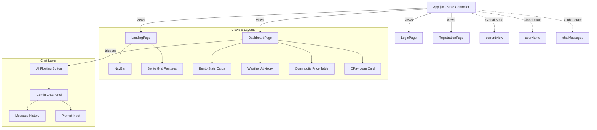

# AgriVerse Web Frontend System Architecture

This document describes the React frontend architecture for the AgriVerse web portal, outlining the component hierarchy, design systems, and state management pattern.

---

## 1. Directory Structure

The frontend project is structured to enforce modularity, reusability, and separation of concerns:

```
frontend/
├── dist/                  # Compiled production build
├── public/                # Static assets (icons.svg, favicon)
├── src/
│   ├── assets/            # Local images (hero.png, logo)
│   ├── components/        # Reusable presentation components
│   │   ├── common/        # Shared components (buttons, cards, headers)
│   │   ├── dashboard/     # Widgets specifically for the portal dashboard
│   │   └── chat/          # Gemini AI chat interface components
│   ├── views/             # Main screen pages (page-level components)
│   │   ├── LandingPage.jsx
│   │   ├── LoginPage.jsx
│   │   ├── RegistrationPage.jsx
│   │   └── DashboardPage.jsx
│   ├── App.jsx            # Routing & Root view controller
│   ├── index.css          # Tailwind CSS v4 entrypoint & Design tokens
│   └── main.jsx           # React app entry point
├── package.json           # Scripts & Dependencies
└── vite.config.js         # Build tool and Tailwind configuration
```

---

## 2. Technical Stack

*   **Core Library**: React 19 (Functional components, Hooks)
*   **Styling**: Tailwind CSS v4
    *   CSS-first configuration in `src/index.css` utilizing custom `@theme` directives for corporate branding.
    *   Responsive layouts optimized for both mobile viewports and large desktop screens.
*   **Build Engine**: Vite 8 (optimized with HMR and quick bundling)
*   **Fonts & Icons**: Inter Google Font and Material Symbols Outlined (loaded from `index.html`)

---

## 3. Architecture & Data Flow



---

## 4. Branding & Styling Guidelines

*   **Primary Palette**: Corporate Emerald Green (`#006c45` / `#1FA971`) for growth, trust, and key actions.
*   **Secondary Palette**: Deep Forest Green (`#0F3D2E` / `#3B6756`) for professional headers and sidebars.
*   **Accent Palette**: Gold (`#7d5800` / `#F4B740`) exclusively reserved for financial status indicators, credits, and verification badges.
*   **AI Indicators**: Gemini Blue (`#2F80ED`) used for AI assistant prompts, buttons, and chat interfaces.
*   **High-Trust Aesthetics**: Utilizes thin borders (`#E6EAE8`), clean shadows (`shadow-sm`), glassmorphism cards (`glass-card`), and gentle micro-animations.
